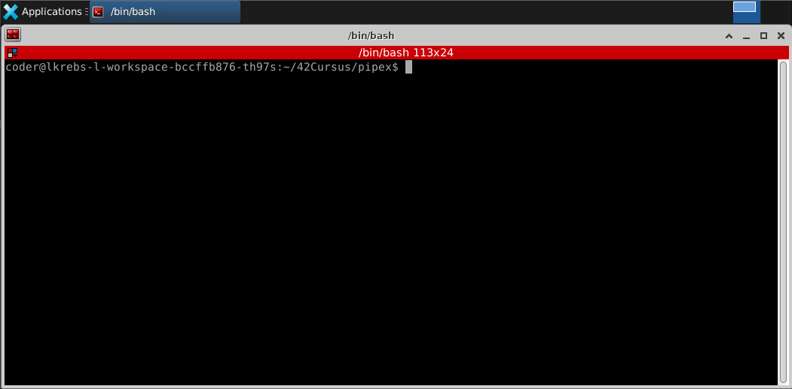

<div align="center">
	<div style="margin-bottom:3%">
		<a href="https://www.42sp.org.br/">
			
		</a>
	</div>
	<div>
		
		
		
	</div>
	<div>
		<a href="https://github.com/KrebsCoder">
			
		</a>
	</div>
</div>


## Pipex

This project is built to simulate the | (pipe) on the bash CLI.

## Dependencies

<a href="https://www.gnu.org/software/make/">Make</a><br>
<a href="https://gcc.gnu.org/">GCC</a><br>
<a href="https://git-scm.com/">Git</a>

## How to run pipex

First thing you need need to do is compile using the following command:

```
make
```

After the compilation, you should have the binary **pipex**, now you can run bash commands, for example:

```
./pipex infile "ls" "wc -l" outfile
```

now you can see the outfile from the commands on the outfile:

```
cat outfile
```

---


---

### feel free to use whatever command you want :smile:
